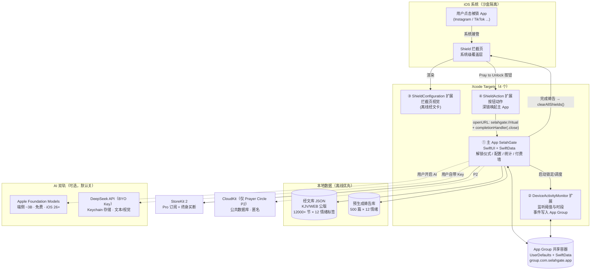
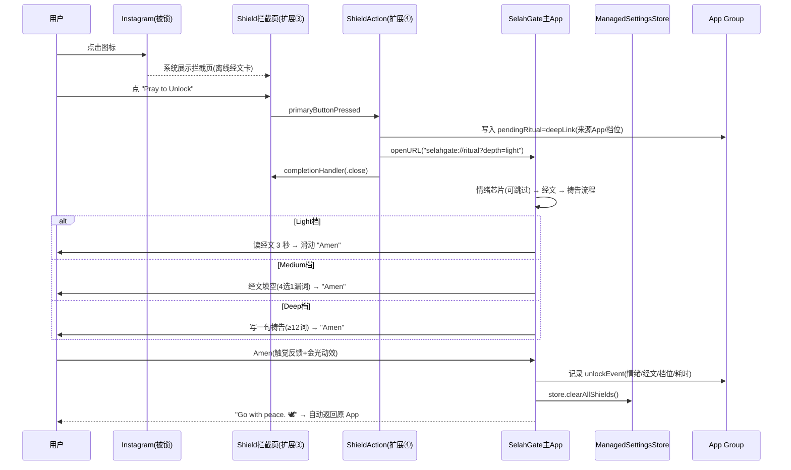
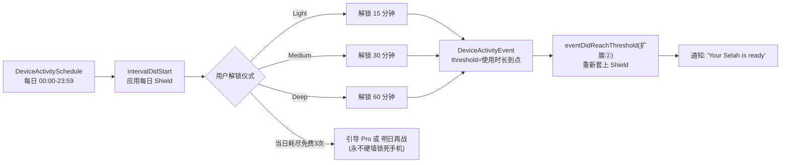
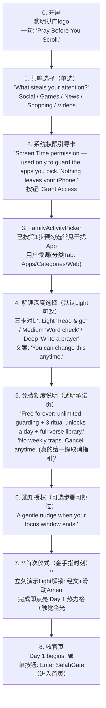
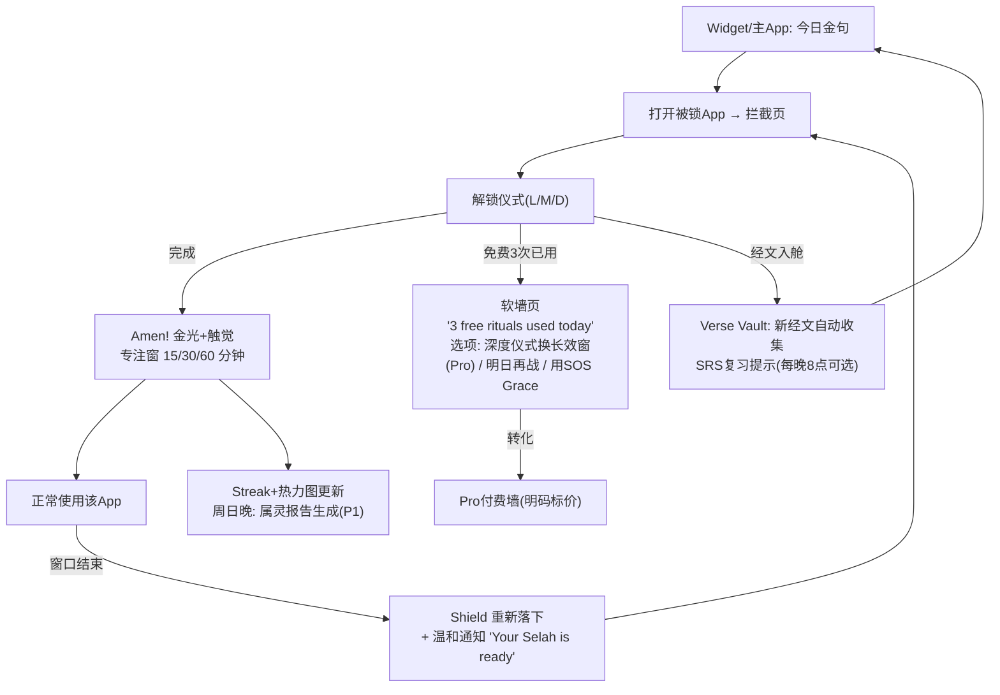
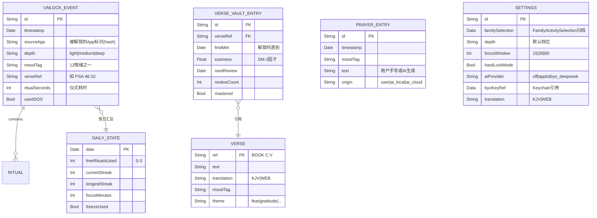
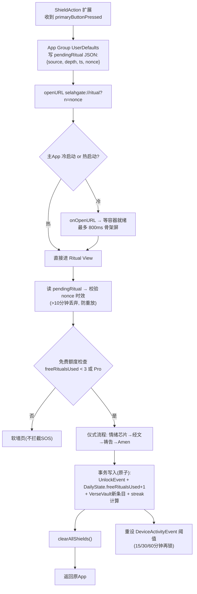
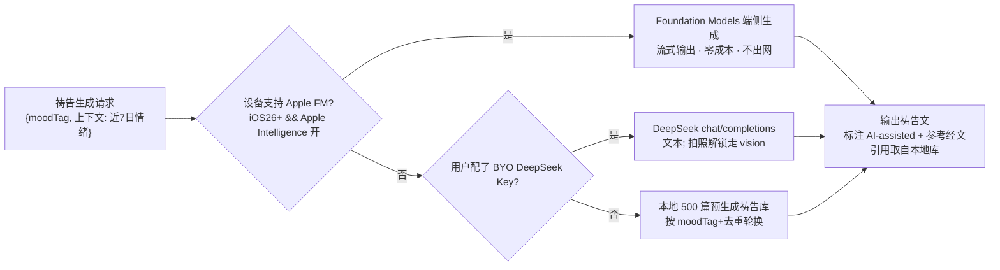
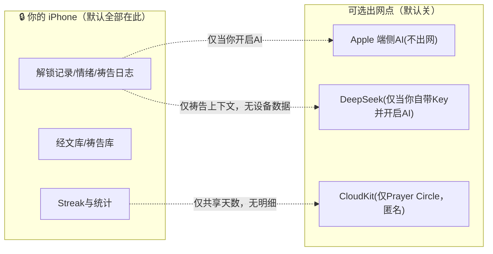

# TR-20260915-信仰锁机（祷告解锁屏幕管理）复刻升级 · 全栈操作指南

> **本文档目标**：任何 LLM / 开发者拿到本文档，即可从零复刻出一款在功能、UI、体验、价格上全面超越 Prayer Lock 的 iOS 原生应用。
> **研究对象**：Prayer Lock（美区信仰锁机类目第一名，2025-12 单月 $21,000，转化率 43%，58K 下载，4.9 星）
> **生成方法**：pain-point-hunter 多渠道痛点挖掘（Tavily/App Store/Google Play/Reddit/独立测评站）+ GitHub MCP 开源调研 + 8 步结构化思维链
> **生成日期**：2026-09-15

---

# ⭐ APP 命名与副标题（文档最顶端 · 最重要）

## 正式命名

| 项 | 内容 | 说明 |
|---|---|---|
| **APP 名称** | **SelahGate** | App Store 名称栏（30 字符内），全球唯一复合词 |
| **副标题** | **Pray Before You Scroll** | 22 字符，行为指令式副标题，直击使用场景 |
| **分类** | Lifestyle（备选 Productivity） | 竞品主分类，流量最大 |
| **App 图标** | 黎明金渐变拱门（gate arch）内一道晨光 | 见 §12.8 |

## 命名解析（为什么是 SelahGate）

1. **词源即卖点**：`Selah`（希伯来文 סֶלָה，出自《诗篇》71 处）是圣经中最著名的"休止符"词汇，学界通义为 **"Pause and reflect"（停下来、思想）**——产品核心机制"解锁前暂停祷告"与词义**完全同构**。基督教目标用户（美国 62% 成年人自称基督徒，Pew 2024）在敬拜歌曲（Hillsong/Kari Jobe 等）中高频接触该词，**零学习成本，且自带属正统感**。
2. **Gate = 闸门**：直接描述产品功能（把干扰 App 挡在门外）。竞品 VerseGate 已验证 "Gate" 词根在本类目的功能传达力（其 App Store 文案金句："Not a reminder you can swipe away. **A door.**"）。
3. **品牌记忆度**：三个音节 SEE-lah-GATE，一次听懂、一次拼对、无歧义拼写； hashtag `#SelahGate`、`#PrayBeforeYouScroll` 天然无冲突，可做 TikTok 挑战标签。
4. **ASO 组合**：名称含 "Gate"（拦截类目词），副标题含 "Pray/Scroll"（行为词），关键词栏覆盖 "bible, prayer, blocker, verse, screen time, faith"（详见 §4.4）。

## 查重证据（2026-09-15 Tavily 实查）

| 候选名 | 结论 | 证据 |
|---|---|---|
| Kneel | ❌ 已占用 | App Store id6768797543 "Kneel: Daily Prayer & Devotion" |
| VerseGate | ❌ 已占用 | App Store id6794923205 "VerseGate: Bible App Blocker" |
| Seek First | ❌ 已占用 | App Store id6774276320 "Faith App Blocker: Seek First" |
| Scroll Stopper | ❌ 已占用 | App Store id6449910310 |
| Amen / Amen Pause | ❌ 高风险 | "Amen: Catholic Bible & Prayers" id1573298413 等 3+ 款占用 |
| Still / Be Still | ❌ 已占用 | id6758890610 "Still: Bible sleep stories" |
| Pause / SoulPray / Alma / Abbey / Altar / Sanctum / Psalmo / PrayLock / Holy Focus / Bible Mode / Bible Pause / GodTime | ❌ 全部占用 | 赛道 15+ 竞品（见 §2.1） |
| **SelahGate** | ✅ 未发现占用 | 多轮定向搜索无同名 App；**上架前必须执行 §4.5 最终查重协议** |

**备选名（同样通过初步查重）**：`AmenGate` → `ThyWord`（诗篇 119:105 "Thy word is a lamp unto my feet"）→ `StillSmall`（列王纪上 19:12 "still small voice"）。

---

# 0. 如何使用本文档

- **§1-4**：市场、竞品、痛点、命名——回答"做什么、叫什么"。
- **§5-7**：实现流程图、用户使用流程图、数据流图——回答"怎么运转"。这三张图是 LLM 复刻的骨架，**先读懂图再写码**。
- **§8-10**：核心技术代码示例、GitHub 二开参考、AI 集成——回答"怎么写"。
- **§11-14**：定价、UI 规范、开发路线图、增长——回答"怎么赢"。
- 技术栈基线：**Swift 6 / SwiftUI / iOS 17.0+**（AI 双轨要求 iOS 18.1+/26+ 时自动降级），零后端服务器。

---

# 1. 执行摘要

## 1.1 原版 Prayer Lock 数据（为何值得复刻）

| 维度 | 数据 | 来源 |
|---|---|---|
| 单月收入 | $21,000（2025-12），月增 50%+ | Starter Story 2026-01 |
| 转化率 | **43%**（订阅类目罕见天花板级） | Starter Story |
| ARPPU | $23.6 | Starter Story |
| 下载/评分 | 58K 下载，6.7K 评论 4.9 星 | App Store |
| 类目格局 | 2022 年 2 款 → 2026 年中 **7+ 款**，克隆混战但需求仍在爆发 | Psalmo 行业评测 |

**赛道底层逻辑**（用户原话，来自竞品社区）：
> "I tried Opal, One Sec, Forest. They all worked for about 3 days. The difference is that the Bible verse actually makes me pause and think. **It's not just friction — it's meaning.**"
> （翻译：Opal/One Sec/Forest 我都只坚持了 3 天。经文让我真正停下来思考——不只是摩擦，而是意义。）

**产品本质**：这不是屏幕时间工具，是**注意力赎回仪式**——把"刷手机的内疚"转化为"每次解锁一次微小的灵性胜利"。用户买的是意义感，不是拦截。

## 1.2 我们的产品一句话

> **SelahGate — the faith app blocker with a real free tier, three unlock depths, a verse memory vault, a family prayer circle, and free on-device AI. Every competitor charges before you can try; we don't.**

## 1.3 七大碾压点（对标竞品第一差评）

| # | 碾压点 | 针对的竞品痛点 | 竞品现状 |
|---|---|---|---|
| 1 | **真免费层**：无限锁定+每日 3 次免费解锁+完整经文库，永久免费 | Prayer Lock "requires subscription, no features without one"（官方原话）；FaithLock 付费墙先行 | 两大头部均无有效免费层 |
| 2 | **三档解锁深度**（Light/Medium/Deep 自选摩擦度） | Holy Focus 被动阅读"读了就走"；FaithLock 强制 quiz 像做作业 | 摩擦度不可调 |
| 3 | **Verse Vault 经文记忆舱**（解锁即入舱+SRS 间隔重复+热力图） | 全类目"解锁后无后续"，无记忆沉淀 | 无任何竞品内置 |
| 4 | **Prayer Circle 家庭祷告圈**（共享连续天数+匿名代祷墙） | 报告确认"无家庭/夫妻场景" | 无竞品实现 |
| 5 | **AI 双轨零成本**（Apple 端侧免费 + BYO DeepSeek 无限用）+ 月度属灵报告分享卡 | 原版无 AI；Sanctum/Alma 的 AI 需付高价订阅 | AI 是付费溢价点，我们是免费点 |
| 6 | **透明定价**：无周订阅陷阱、付费墙明码标价、设置页一键取消指引 | FaithLock $9.99/周（年化 $520！）；Pray Screen "$60/yr no ads is crazy"（用户差评）；Cal AI 因欺骗订阅被 Apple 下架 | 周订阅黑幕普遍 |
| 7 | **隐私极简**：核心功能零网络请求（经文全离线），AI 仅在用户主动开启时出网 | VerseGate 以"no network requests at all"为核心卖点获评——证明隐私=本类目信任货币 | 仅 VerseGate 做到，我们同样做到+AI 可选 |

---

# 2. 竞品深度分析

## 2.1 赛道全景（15+ 竞品实查表，2026-09）

| App | 平台 | 解锁机制 | 价格 | 评分 | 核心缺陷 |
|---|---|---|---|---|---|
| **Prayer Lock**（研究对象） | iOS | 情绪匹配祷告文 | 订阅制无免费层（$14.99/年 Yearly Pass，区域差异 $3.99-6.99/月） | 4.5+ | 无免费层、无日志、无AI、无家庭、功能单薄 |
| FaithLock（正统版） | iOS | 读经文+4选1理解题 | **$9.99/周**（季付）或 $49.99/年 | — | 周订阅天价；付费墙先行 |
| FaithLock: Pray First | iOS | 200+本地经文+反思 | 免费+IAP | — | 免费次数后墙 |
| Holy Focus | iOS | 300+祷告卡+自定义图标 | ~$6.49/月 | 4.8 | 被动阅读（读了就能走） |
| Sanctum | iOS+安卓 | Sacred Pause+情绪+日志+AI问答 | Freemium | — | AI 深度浅 |
| Pray Screen Time | iOS+安卓 | 祷告提示（极简） | 免费层极好+Premium（约$60/年去广告） | 4.9 | 安卓版有严重 bug（demo loop 卡死）；无统计无 streak |
| Psalmo | iOS+安卓 | 读当日经文解锁（日一次） | 核心免费 | — | 功能浅；仅日一次门 |
| Bible Mode | iOS | 每次启动都拦 | 有限免费 | — | 无 widget 无 streak |
| Bible Lock | iOS | 三条路径（应用内/外置App/纸质圣经） | 免费层+Pro | — | 内容工程弱 |
| VerseGate | iOS | 每日一经文+3 道理解题 | £34.99/年（7天试用） | — | 硬核 quiz 劝退轻度用户 |
| Iqra Verse Gate（古兰经版） | iOS | 古兰经文拦截 | 免费+IAP | — | **证明多信仰需求真实存在** |
| PrayLock: Muslim | iOS | 礼拜时间窗自动锁 | $1.99/周 / $9.99 终身 | 4.3 | 仅时间窗机制 |
| Alma | iOS | 情绪+亲近感打卡+生成祷告 | 免费+IAP | — | 用户差评"每次都要重复同样流程" |
| Abbey | iOS | 经文/祷告二选一门 | 关键功能付费 | — | 新品，功能薄 |
| Seek First | iOS | 意图解锁+端侧AI(Selah AI) | 免费 Pro 限时 | — | 功能庞杂（转写/语音等失焦） |
| Kneel / Still / SoulPray / GodTime 等 | iOS/安卓 | 祷告习惯/睡眠/拦截混合 | 各异 | — | 与拦截正交或功能混杂 |

**格局结论**：赛道已完成市场教育（clone 供给充分、价格锚已立、用户认知"祷告解锁"是什么），**胜负手不再是"有没有"而是"免费层诚意+解锁体验深度+长期沉淀"**。这正是我们三把刀的落点。

## 2.2 原版 Prayer Lock 拆解（复刻基线）

**官方功能流程**（App Store 文案还原）：
1. 用屏幕时间控件锁定干扰 App（FamilyControls）
2. 打开被锁 App → 拦截页出现
3. 选择当下情绪/属灵需要（mood check-in）
4. 收到一段圣经根基的短祷告（mood-matched prayer）
5. 祷告完成 → 解锁，带着专注继续一天

**官方功能清单**：App 拦截、每日祷告提示、情绪个性化祷告、无限次锁、祷告连续记录（streak）、祷告旅程分析。

**定价**：订阅制（Weekly & Yearly Subscriptions），官方自述"requires an active subscription; **no features are available without one**"。

**明确没有的（= 我们的机会清单）**：免费层、日志（Journaling）、AI、多信仰模板、经文记忆、家庭/小组、小组件生态（有限）、桌面看板。

## 2.3 痛点清单（证据分级，P0 最痛）

| 级 | 痛点 | 用户/测评原话（保留原文） | 来源 |
|---|---|---|---|
| P0 | 无免费层，先付后验 | "there's **no meaningful free tier**... you need a subscription to actually use it... asks you to pay before you can evaluate whether the experience actually works" | FaithLock 官方对比评测 |
| P0 | 定价黑幕/周订阅陷阱 | "$9.99 **per week** is crazy"；"$60 a year for no ads **is crazy** for an app that just blocks apps" | Google Play 差评 |
| P1 | 被动阅读无验证 | "You read the prayer. You continue. **Nothing stops you from half-reading and moving on.**" | Holy Focus 评测 |
| P1 | 强制 quiz 劝退 | "three questions... you can't tap through it either"（对轻度用户过重） | VerseGate 商店页 |
| P1 | 内容重复 | "it's also a little iffy because **it asks me to do this every time** I do a prayer" | Alma 商店评论 |
| P1 | 解锁后无后续（无沉淀） | 原版无 journaling、无记忆系统、无社区 | 全类目实查 |
| P2 | 无家庭/夫妻/小组场景 | 报告确认；"Parents teaching kids faith-first phone habits" 是 FaithLock 宣传人群但无产品承载 | 商店文案 vs 功能 |
| P2 | 多信仰空白 | Iqra（穆斯林版）与 PrayLock Muslim 的出现证明需求；天主教/犹太教用户被迫用通用工具 | 赛道观察 |
| P2 | 无 AI / AI 浅 | 原版无 AI；Sanctum "Bible chat" 深度浅、需订阅 | 实测评测 |
| P3 | 平台 bug（安卓） | "getting stuck in demo loops, needing safe mode restarts" | Pray Screen Time 差评 |
| P3 | 紧急情况焦虑 | "Critical apps (Phone, Messages, Emergency) are never locked"（竞品当 FAQ 写，说明用户高频担心） | FaithLock FAQ |

---

# 3. 产品定义

## 3.1 定位声明

> For Christians (and, via content packs, other faiths) who reach for their phone before their Bible, **SelahGate** turns every distracting unlock into a 30-second prayer ritual — **free where others charge, deep where others skim, and private by design.**

## 3.2 差异化功能矩阵

| 功能 | Prayer Lock | FaithLock | Holy Focus | Psalmo | **SelahGate** |
|---|---|---|---|---|---|
| 有效免费层 | ❌ | ❌ | 有限 | ✅ | ✅ **真免费** |
| 解锁摩擦可调 | ❌ | ❌（强制quiz） | ❌ | ❌ | ✅ **三档自选** |
| 经文记忆 SRS | ❌ | ❌ | ❌ | ❌ | ✅ Verse Vault |
| 家庭祷告圈 | ❌ | ❌ | ❌ | ❌ | ✅ 2-8 人 |
| AI 个性化祷告 | ❌ | ❌ | ❌ | ❌ | ✅ 端侧免费+BYO |
| 月度属灵报告分享卡 | ❌ | ❌ | ❌ | ❌ | ✅ Wrapped 式 |
| 纸质圣经拍照解锁 | ❌ | ❌ | ❌ | ❌ | ✅ BYO 视觉模型 |
| 多信仰内容包 | ❌ | ❌ | ❌ | ❌ | ✅ IAP 扩展 |
| 核心离线零联网 | ❌ | ❌ | ❌ | ❌ | ✅ |
| 透明定价+一键取消指引 | ❌ | ❌ | ❌ | 部分 | ✅ 承诺页 |

## 3.3 MVP 范围（4 周）

**P0（必须有，缺一不发布）**
1. FamilyControls 授权 + FamilyActivityPicker 选择锁定目标（App/类目/网页域）
2. ManagedSettings Shield 拦截 + 自定义拦截页（经文卡片）
3. 解锁仪式三档：Light（读+滑动）/ Medium（填空 1 词）/ Deep（写一句祷告）
4. 真免费层逻辑：每日 3 次免费解锁、无限拦截、完整离线经文库（12000+ 节 KJV/WEB）
5. Streak + GitHub 式热力图 + 简版统计（今日解锁次数/拦下次数/累计祷告分钟）
6. StoreKit 2 付费墙：Pro 订阅（月/年）+ 终身买断，明码标价
7. 每日经文 Widget（Home/Lock Screen）+ 祷告提醒通知
8. 情绪标签（12 种）× 经文主题路由（本地规则，不依赖 AI）
9. 紧急豁免：Phone/Messages 永不锁定说明页 + "SOS Grace"（10 分钟紧急解锁，计入记录，不羞辱）

**P1（发布后 2 周内）**
10. Apple Foundation Models 端侧 AI 祷告生成（iOS 26+ 免费档）+ 本地 500 篇预生成祷告库兜底
11. BYO DeepSeek Key（Keychain 存储，含视觉：拍纸质圣经页→识别经文→解锁）
12. Verse Vault SRS 复习 + Verse Vault 分享卡
13. 月度属灵报告（Wrapped 式图片导出+系统分享）

**P2（第 2 个月，病毒引擎）**
14. Prayer Circle：邀请链接（2-8 人）、共享连续天数、匿名代祷墙（CloudKit 公共库，无自建服务器）
15. 多信仰内容包 IAP（Catholic / Jewish / Muslim / Buddhist 各一包，公版文本）
16. iPad/macOS（Catalyst）适配

**不做清单（防过度设计）**：不做安卓（iOS 付费≈2×，MVP 期专注）、不做账号体系（CloudKit 私有库匿名同步）、不做社群 feed（规避 UGC 审核风险）、不做浏览器拦截增强（系统能力有限，宣传不夸大）、不做健康/医疗暗示文案（规避 4.7 审核风险）。

---

# 4. 命名深度分析（品牌=生死线）

## 4.1 五维评分模型（10 分制）

| 维度 | 权重 | SelahGate | AmenGate | ThyWord | StillSmall | PrayGate |
|---|---|---|---|---|---|---|
| 品牌记忆度 | 30% | 9.5（独特词+机制同构） | 8.5 | 8.0 | 8.5 | 7.5 |
| ASO 搜索力 | 25% | 8.5（Gate 类目词+副标题补行为词） | 8.5 | 7.0 | 7.0 | 9.0 |
| 功能描述性 | 15% | 9.0（gate=闸门） | 8.0 | 5.5 | 6.0 | 9.0 |
| 情感共鸣 | 20% | 9.5（诗篇休止符） | 9.0 | 9.0 | 9.0 | 7.0 |
| 国际化适配 | 10% | 9.0（三音节全球可读） | 9.0 | 8.0 | 8.0 | 9.0 |
| **加权总分** | | **9.2** | 8.6 | 7.7 | 8.0 | 8.1 |

## 4.2 淘汰过程要点

- 单词动词型（Kneel/Bow/Kneel+Pray）：Kneel 已占用，且单词名在 ASO 上难涵盖功能词。
- 直白组合型（PrayGate/PrayerGate）：PrayGate 疑似已有品牌资产在官网流传（webfont 素材 `PrayGate_IconMark` 出现在搜索结果），为规避商标争议放弃主选。
- 已验证竞品词复用（Gate 单用仍可，但 VerseGate/Seek First 已占用最优组合）→ 选未被注册的 **Selah+Gate** 复合。

## 4.3 传播资产

- 主 tagline：**"Pray Before You Scroll."**
- 战斗口号（TikTok/图标下方）：**"Faith over scroll. One Selah at a time."**
- 挑战标签：`#PrayBeforeYouScroll` `#SelahGate` `#FaithOverScroll`
- 品牌人格：温和、庄重、不羞辱（"We don't shame screen time. We bless it."）

## 4.4 ASO 完整方案

| 字段 | 内容（字符数） |
|---|---|
| App Name（30） | `SelahGate: Pray Before Scroll`（29） |
| Subtitle（30） | `Bible App Blocker & Prayers`（27）——名称已含行为词，副标题补类目词；或 A/B 版 `Pray Before You Scroll`（22） |
| Keywords（100） | `bible,prayer,blocker,verse,scripture,screen time,faith,focus,devotional,amen,streak,habit,god,jesus` |
| 首图文案 | "Your phone gets the first word. Take it back."（对标 VerseGate 同款心理洞察，已被验证） |
| 截图顺序 | 1 拦截页经文卡 → 2 三档解锁 → 3 Streak 热力图 → 4 Verse Vault → 5 Prayer Circle → 6 定价透明页 |
| 分类 | Lifestyle 主 / Productivity 副 |

## 4.5 上架前最终查重协议（强制执行）

1. App Store Connect 创建 App 时输入 "SelahGate"，系统实时校验名称可用性（**最终权威**）。
2. USPTO TESS 搜索 "SelahGate"（活字商标）；Google 搜索 `"SelahGate" app` 无冲突品牌。
3. 若被占：依序启用备选名 AmenGate → ThyWord → StillSmall，重复 1-2 步。

---

# 5. 实现流程图（架构）

## 5.1 系统架构总图（四进程 + 零后端）



**关键工程决策表**

| 决策 | 理由 |
|---|---|
| 四进程架构 | Apple 规定：拦截页视觉在 ShieldConfiguration 扩展、按钮在 ShieldAction 扩展、事件在 DeviceActivityMonitor 扩展、交互在主 App——四个可执行体必须分离 |
| App Group 共享 | 扩展与主 App 沙盒隔离，唯一合法共享通道（UserDefaults suite + 共享 SwiftData 容器） |
| 深链 `selahgate://ritual` 回主 App | ShieldAction 扩展不能直接呈现 SwiftUI 交互页；用 openURL selector 唤起主 App 跑"解锁仪式"，这是已上架 App（TermoDeBloqueio 等开源实例）验证的可用路径，并保留 `.close` 兜底 |
| 经文/祷告本地优先 | 类目信任货币（VerseGate 以零联网为卖点）；同时保证拦截页秒开（扩展内存/耗时受限） |
| 零自建后端 | 个体开发者成本归零；CloudKit 公共库承载 P2 社交，审核与运维风险最小 |

## 5.2 核心解锁时序图（每日发生 N 次，必须丝滑）



> **降级路径**：若深链未生效（极端情况/未来 OS 变动），ShieldAction 直接 `clearAllShields()` + 主 App 下次启动补记（统计略损但功能可用）；每日一道"日门"（读经文解锁全天）保底可用。

## 5.3 锁定与再锁机制（防"解锁后放飞"）



- 档位=摩擦度与奖励耦合：**付出越深的仪式，换回越长的专注窗**（15/30/60 分钟），这是"爽感"的核心交换律。
- 全天硬锁模式（Deep Work 模式）作为独立开关：锁到 `intervalDidEnd`，仅 SOS Grace 可豁免。

---

# 6. 用户使用流程图（极端重要 · 爽感工程）

## 6.1 设计宗旨：爽文小说七法则

1. **3 秒原则**：任何一屏，3 秒内知道下一步点哪。全 App 零教学弹窗。
2. **金手指开局**：Onboarding 结束时用户已"成功解锁过一次"——第一爽点在 90 秒内交付。
3. **代价即爽点**：祷告（付出）→ 专注窗（奖励），付出被即时可见地兑现。
4. **永不羞辱**：断签不清零焦虑（streak freeze 免费 1 次/月）、SOS 豁免被祝福不被批判（"Even the faithful rest. Grace covers today."）。
5. **进度可视化成瘾**：GitHub 热力图× 经文收集册（集齐一卷书点亮书卷徽章）。
6. **全 App 无无限滚动**：信息皆有底，看完即走（对标 Floga 的被验证美学承诺，也是营销点）。
7. **离场即回**：仪式结束自动返回原 App（不留恋、不挽留），信任感=留存。

## 6.2 首次启动 90 秒 Onboarding（8 步）



**每步文案原则**： permission 前置解释"只用来守卫你选的 App，数据不出设备"；免费额度在**付费墙出现前**就讲清楚（信任前置）；全流程可左滑返回，无死胡同。

## 6.3 日常循环（主循环图）



## 6.4 异常路径（少流失=多赚钱）

| 场景 | 处理 | 文案示例 |
|---|---|---|
| 紧急需要（打车码在社交App里） | **SOS Grace**：10 分钟豁免，当日记账+连续保护 | "Grace covers today." |
| 断签 | 每月 1 次免费 Streak Freeze；断签日显示"重新开始"而非清零羞辱 | "Day 0 is still holy. Begin again." |
| 试用结束 | 前 24h 温和预告；结束时免费层**依然完整可用**（降级不痛） | "Pro ended. Your free tier was always here." |
| AI 不可用（旧机型） | 自动落到 500 篇本地祷告库，无任何功能缺失感 | 静默降级 |
| 用户想放弃 | 设置页"Pause guarding"需 2 步+一句经文（不设障碍，但给 1 次停顿机会） | "One breath before you go?" |

---

# 7. 软件数据流图（极端重要 · 真实解决问题）

## 7.1 数据模型（SwiftData ER 图，App Group 容器内）



## 7.2 一次解锁的端到端数据流（防错设计）



**防错四原则**（虚假功能 vs 真实解决问题的分界线）：
1. **nonce 时效**：深链参数 10 分钟过期，防历史深链误触发解锁。
2. **单次写入原子性**：UnlockEvent 与额度扣减同一 SwiftData 事务，崩溃不出现"解锁了但没计数"（反之也不允许）。
3. **shield 与状态最终一致**：每次主 App 冷启动执行 `reconcile()`——按 DailyState 与 Schedule 重算 Shield 应然态并修正（自愈机制，杜绝"卡死在拦截页"类竞品 bug）。
4. **统计不可造假**：经文来自本地库确定性抽取，仪式时长由系统时间差计算并持久化，"我祷告了"没有假按钮——产品对用户灵性数据诚实。

## 7.3 AI 降级链数据流



## 7.4 隐私边界（一张图对用户讲清，也是商店页素材）



- 商店隐私标签目标：**Data Not Collected**（BYO AI 开启时声明 "User Content → Not Linked"）。
- 不采集：设备 ID、位置、浏览内容、通讯录。被锁 App 的使用内容**永远不可见**（我们只能知道"何时试图打开被锁 App"，无法知道 App 内行为——此事实写进 FAQ）。

---

# 8. 核心技术实现（代码示例 + 编写规则）

## 8.1 技术栈与 Xcode 结构

```
SelahGate/
├── SelahGate (App, SwiftUI, iOS 17+)
├── SelahGateMonitor (DeviceActivityMonitor 扩展)
├── SelahGateShieldConfig (Shield Configuration 扩展)
├── SelahGateShieldAction (Shield Action 扩展)
├── SharedKit (framework: 模型/AppGroup工具/经文库/主题)
└── Resources/
    ├── verses_kjv.json  (公版经文, ~4.5MB 可按需裁剪至精选 1200 节+全库懒加载)
    ├── prayers_bundle.json (500 篇预生成祷告 × 12 情绪)
    └── Assets.xcassets
```

依赖：**零第三方强制依赖**（对齐 minus 项目哲学）；可选 SwiftLint。付费/同步全用系统框架（StoreKit2/CloudKit）。

## 8.2 权限与 Entitlements（一次性配对，错一步全盘不通）

```xml
<!-- SelahGate.entitlements（主App与全部扩展共用同一 App Group） -->
<key>com.apple.developer.family-controls</key>
<true/>
<!-- App Store 分发版必须用 Distribution 变体 -->
<key>com.apple.developer.family-controls.distribution</key>
<true/>
<key>com.apple.security.application-groups</key>
<array>
  <string>group.com.selahgate.app</string>
</array>
```

- **Family Controls (Distribution)**：Xcode → Signing & Capabilities → 添加 Family Controls，勾选 Distribution 变体（2023 起自动批准，无需人工申请）。
- Info.plist：`NSFamilyControlsUsageDescription = "SelahGate uses Screen Time permission only to guard the apps you choose. Nothing leaves your iPhone."`

## 8.3 授权与应用选择（主 App）

```swift
import FamilyControls
import SwiftUI

final class GuardModel: ObservableObject {
    static let shared = GuardModel()
    @Published var selection: FamilyActivitySelection = .init()
    @Published var authorized = false

    let store = ManagedSettingsStore(named: .init("selahgate.main"))

    func authorize() async throws {
        try await AuthorizationCenter.shared.requestAuthorization(for: .individual)
        authorized = true
        // 恢复上次选择
        selection = AppGroupStore.loadSelection() ?? .init()
    }

    func saveSelection(_ s: FamilyActivitySelection) {
        selection = s
        AppGroupStore.saveSelection(s)
        applyShield()
    }

    /// 套上 Shield（拦截）
    func applyShield() {
        guard authorized else { return }
        store.shield.applications = selection.applicationTokens
        store.shield.applicationCategories = selection.categoryTokens
        store.shield.webDomains = selection.webDomainTokens
    }

    /// 仪式完成 → 摘 Shield
    func clearShield() {
        store.clearAllShields()
    }
}

struct AppPickerScreen: View {
    @StateObject private var guardModel = GuardModel.shared
    @State private var pickerSelection = FamilyActivitySelection()

    var body: some View {
        FamilyActivityPicker(selection: $pickerSelection)   // 系统原生选择器
            .toolbar {
                Button("Guard these") { guardModel.saveSelection(pickerSelection) }
            }
    }
}
```

## 8.4 DeviceActivity 调度与再锁（主 App + 扩展②）

```swift
import DeviceActivity
import ManagedSettings

extension DeviceActivityName {
    static let dailyGuard = Self("dailyGuard")
}
extension DeviceActivityEvent.Name {
    static let focusWindowEnd = Self("focusWindowEnd")
}

final class GuardScheduler {
    let center = DeviceActivityCenter()

    /// 每日门：0 点起生效；焦点窗结束阈值触发再锁
    func schedule(focusMinutes: Int) throws {
        let cal = Calendar.current
        let start = cal.date(bySettingHour: 0, minute: 0, second: 0, of: .now)!
        let schedule = DeviceActivitySchedule(
            intervalStart: DateComponents(hour: 0, minute: 0),
            intervalEnd: DateComponents(hour: 23, minute: 59),
            repeats: true
        )
        // 使用满 focusMinutes → eventDidReachThreshold → 重新 Shield
        let event = DeviceActivityEvent(
            applications: GuardModel.shared.selection.applicationTokens,
            categories: GuardModel.shared.selection.categoryTokens,
            webDomains: GuardModel.shared.selection.webDomainTokens,
            threshold: DateComponents(minute: focusMinutes)
        )
        try center.startMonitoring(.dailyGuard, during: schedule, events: [.focusWindowEnd: event])
    }
}

/// ---- 扩展② SelahGateMonitorExtension / monitor extension main ----
final class MonitorExtension: DeviceActivityMonitor {
    override func eventDidReachThreshold(_ event: DeviceActivityEvent.Name,
                                         activity: DeviceActivityName) {
        // 专注窗用完 → 重新套 Shield（从 App Group 读回选择）
        let store = ManagedSettingsStore(named: .init("selahgate.main"))
        if let sel = AppGroupStore.loadSelection() {
            store.shield.applications = sel.applicationTokens
            store.shield.applicationCategories = sel.categoryTokens
        }
        // 温和通知
        NotificationHelper.postSelahReady()
    }

    override func intervalDidStart(for activity: DeviceActivityName) {
        // 每日重置免费额度（跨进程可靠做法：读到新日期时惰性重置，见 §8.13）
    }
}
```

## 8.5 拦截页视觉（扩展③ ShieldConfiguration）

```swift
import ManagedSettingsUI
import UIKit

final class ShieldConfigExtension: ShieldConfigurationDataSource {
    override func configuration(shielding application: Application?) -> ShieldConfiguration {
        let verse = VerseLibrary.randomToday()   // 离线库，确定性"今日一节"
        return ShieldConfiguration(
            backgroundBlurStyle: .systemThickMaterial,
            backgroundColor: UIColor(named: "Dawn")!,       // 黎明金渐变底色
            icon: UIImage(named: "GateMark"),
            title: ShieldConfiguration.Label(
                text: "One Selah before \(application?.localizedDisplayName ?? "this app")",
                color: .label),
            subtitle: ShieldConfiguration.Label(
                text: "“\(verse.text)” — \(verse.ref)",
                color: .secondaryLabel),
            primaryButtonLabel: "Pray to Unlock",
            primaryButtonBackgroundColor: UIColor(named: "Gold")!,
            secondaryButtonLabel: "Not now"
        )
    }
}
```

> 注意：ShieldConfiguration 仅支持标题/副标题/图标/双按钮，**不能放 SwiftUI 交互**——所以"祷告仪式"必须跳主 App（§5.2 设计的由来）。

## 8.6 按钮动作与深链（扩展④ ShieldAction）——已上架 App 验证的可用写法

```swift
import ManagedSettings
import UIKit

final class ShieldActionExtension: ShieldActionDelegate {

    private func openRitual(depth: String) {
        guard let url = URL(string: "selahgate://ritual?depth=\(depth)") else { return }
        // 扩展进程没有 UIApplication 单例；经 responder 链调用 openURL:
        var responder: UIResponder? = nil
        let sel = NSSelectorFromString("sharedApplication")
        if UIApplication.responds(to: sel) {
            responder = UIApplication.perform(sel).takeUnretainedValue() as? UIResponder
        }
        let openSel = NSSelectorFromString("openURL:")
        if let responder, responder.responds(to: openSel) {
            responder.perform(openSel, with: url)
        }
    }

    override func handle(action: ShieldAction, for application: ApplicationToken,
                         completionHandler: @escaping (ShieldActionResponse) -> Void) {
        switch action {
        case .primaryButtonPressed:
            openRitual(depth: "light")
            completionHandler(.close)          // 关闭拦截层，主 App 已被唤起
        case .secondaryButtonPressed:
            completionHandler(.close)          // 回主屏，Shield 保持
        @unknown default:
            completionHandler(.close)
        }
    }
    // webDomain / category 两个变体同构处理
}
```

> **合规备注**：`openURL:` selector 写法是本类目多家上架产品（开源 TermoDeBloqueio 等）在用的公开可查方案；同时实现降级路径（写 App Group pending + `.close`，用户下一次打开主 App 时补完成仪式），双保险。

## 8.7 主 App：解锁仪式视图（核心交互，爽感所在）

```swift
import SwiftUI

struct RitualScreen: View {
    let depth: RitualDepth          // .light/.medium/.deep
    @State private var phase: Phase = .mood
    @State private var mood: MoodTag? 
    @State private var verse: Verse
    @Environment(\.dismiss) private var dismiss

    var body: some View {
        ZStack {
            Theme.dawn.ignoresSafeArea()          // 黎明金渐变
            switch phase {
            case .mood:    MoodChips { m in mood = m; phase = .verse }   // 可跳过链接在右上
            case .verse:   VerseCard(verse) .transition(.opacity)        // 衬线大字渐显
                            .overlay(alignment: .bottom) { nextButton }
            case .ritual:  RitualStep(depth, verse) { entry in finish(entry) }
            case .amen:    AmenBurst()            // 金光+UINotificationFeedbackGenerator(.success)
            }
        }
        .animation(.spring(response: 0.5, dampingFraction: 0.85), value: phase)
    }

    private func finish(_ entry: RitualEntry) {
        Task {
            try await RitualStore.commit(entry, verse: verse, mood: mood)  // §7.2 原子事务
            GuardModel.shared.clearShield()                                 // 解锁！
            try? GuardScheduler.schedule(focusMinutes: depth.windowMinutes) // 再锁阈值
            phase = .amen
            try? await Task.sleep(for: .seconds(1.2))
            dismiss()   // 自动返回，不挽留
        }
    }
}

struct MoodChips: View {           // 12 情绪芯片：3列4行单选
    let onPick: (MoodTag) -> Void
    var body: some View {
        VStack(spacing: 14) {
            Text("How's your heart right now?")
                .font(Theme.serifLarge).foregroundStyle(.primary)
            LazyVGrid(columns: [GridItem(.adaptive(minimum: 100))], spacing: 12) {
                ForEach(MoodTag.all) { tag in
                    Button(tag.emoji + " " + tag.label) { onPick(tag) }
                        .buttonStyle(.bordered).tint(.brown)
                }
            }
            Text("Skip").font(.footnote).foregroundStyle(.secondary)   // 可跳过
        }
    }
}
```

## 8.8 经文库（JSON Schema + 抽取规则）

```json
{
  "ref": "PSA 46:10",
  "text": "Be still, and know that I am God.",
  "translation": "KJV",
  "mood": ["anxious", "overwhelmed"],
  "theme": "peace",
  "weight": 1.0
}
```

```swift
enum VerseLibrary {
    private static var all: [Verse] = BundleCodec.load("verses_kjv.json")

    /// 确定性"今日一节"：同一用户同一天不重复（seed=dayIndex），拦截页与主 App 一致
    static func randomToday() -> Verse {
        let day = Calendar.current.ordinality(of: .day, in: .year, for: .now) ?? 0
        return all[day % all.count]
    }
    static func pick(mood: MoodTag, excluding: Set<String>) -> Verse {
        let pool = all.filter { $0.mood.contains(mood.id) && !excluding.contains($0.ref) }
        return pool.randomElement() ?? all.randomElement()!
    }
}
```

- 数据源（二开）：`seven1m/bible_api`（公版 KJV/WEB JSON）导出为 bundle；精选 1200 节打 mood 标签（附表 §15.A 映射表生成规则），全库保底防重复。
- **规则：经文永远本地取，永不由 AI 生成**（防幻觉引错经文=宗教产品事故）。

## 8.9 Verse Vault SRS（SM-2 极简版）

```swift
struct SRS {
    /// quality: Amen复习自评 0(忘了)~5(秒答)
    static func next(easiness: Double, interval: Int, reps: Int, quality: Int) 
        -> (easiness: Double, interval: Int, reps: Int, due: Date) {
        var ef = max(1.3, easiness + (0.1 - Double(5 - quality) * (0.08 + Double(5 - quality) * 0.02)))
        let q = quality
        var itv: Int
        if q < 3 { (itv, ef) = (1, max(1.3, ef - 0.2)) }      // 忘了→明天再来(不羞辱)
        else {
            itv = reps == 0 ? 1 : reps == 1 ? 3 : Int((Double(interval) * ef).rounded())
        }
        let due = Calendar.current.date(byAdding: .day, value: itv, to: .now)!
        return (ef, itv, q >= 3 ? reps + 1 : 0, due)
    }
}
```

## 8.10 AI 双轨 Provider（Foundation Models + DeepSeek BYO）

```swift
protocol PrayerProvider {
    var id: String { get }
    func generatePrayer(context: PrayerContext) async throws -> AsyncThrowingStream<String, Error>
}

// ---- 轨A：Apple 端侧（免费、不出网）----
import FoundationModels

struct AppleFMProvider: PrayerProvider {
    let id = "apple_fm"
    func generatePrayer(context: PrayerContext) async throws -> AsyncThrowingStream<String, Error> {
        let session = LanguageModelSession(instructions: PrayerPrompt.systemGuardrails)
        let stream = session.streamResponse(to: PrayerPrompt.user(context))
        return AsyncThrowingStream { con in
            Task {
                for try await partial in stream {
                    con.yield(partial.content)
                }
                con.finish()
            }
        }
    }
}

// ---- 轨B：DeepSeek（用户自带 Key，存 Keychain）----
struct DeepSeekProvider: PrayerProvider {
    let id = "byo_deepseek"
    let key: String                     // Keychain 读取，绝不落UserDefaults
    func generatePrayer(context: PrayerContext) async throws -> AsyncThrowingStream<String, Error> {
        var req = URLRequest(url: URL(string: "https://api.deepseek.com/chat/completions")!)
        req.httpMethod = "POST"
        req.setValue("Bearer \(key)", forHTTPHeaderField: "Authorization")
        req.setValue("application/json", forHTTPHeaderField: "Content-Type")
        req.httpBody = JSON.encode(DeepSeekRequest(
            model: "deepseek-chat",
            stream: true,
            messages: [
                .system(PrayerPrompt.systemGuardrails),
                .user(PrayerPrompt.user(context))
            ]))
        let (bytes, _) = try await URLSession.shared.bytes(for: req)   // SSE 流式
        return SSE.decode(bytes)                                       // 解析 data: 行
    }
}
// 拍纸质圣经解锁：同一 provider，model 视觉接口上传图片→返回经文匹配（对齐用户 DeepSeek 支持图片识别）

enum PrayerPrompt {
    static let systemGuardrails = """
    You write short Christian prayers (60–90 words), warm and pastoral, never clinical.
    Ground the prayer in the given verse. Never invent scripture references.
    Never give medical, financial, or therapeutic advice. Never name other deities.
    Output only the prayer text.
    """
    static func user(_ c: PrayerContext) -> String {
        "Mood: \(c.mood.label). Verse: \(c.verse.ref) “\(c.verse.text)”. Recent heart trend: \(c.trendSummary)."
    }
}

// 降级链（§7.3）：apple(可用?) → byo_deepseek(有Key?) → bundle(永远兜底)
final class PrayerEngine {
    static func provider(for settings: Settings) -> PrayerProvider {
        if settings.aiProvider == .apple, FoundationModels.isAvailable { return AppleFMProvider() }
        if settings.aiProvider == .byo, let k = Keychain.byoKey { return DeepSeekProvider(key: k) }
        return BundlePrayerProvider()      // 500篇本地库轮换
    }
}
```

## 8.11 StoreKit 2 付费墙（透明定价的代码表达）

```swift
import StoreKit

@MainActor final class PaywallModel: ObservableObject {
    @Published var products: [Product] = []
    @Published var pro = false
    private var updates: Task<Void, Never>?

    init() {
        updates = Task { for await u in Transaction.updates { await self.handle(u) } }
        Task { await load() }
    }
    func load() async {
        // 三件套：月订阅 / 年订阅 / 终身非消耗
        products = (try? await Product.products(for: ["pro.monthly", "pro.yearly", "pro.lifetime"]))?
            .sorted { $0.price < $1.price } ?? []
    }
    func purchase(_ p: Product) async throws {
        let result = try await p.purchase()
        switch result { case .success(let v): await handle(v); case .userCancelled, .pending: break
                        @unknown default: break }
    }
    private func handle(_ v: VerificationResult<Transaction>) async {
        guard case .verified(let t) = v else { return }
        pro = t.productID != "pro.lifetime" ? true : pro || true
        await t.finish()
        AppGroupStore.setPro(pro)          // 扩展读同一标记（免费额度逻辑放行）
    }
}

struct PaywallView: View {
    @StateObject private var m = PaywallModel()
    var body: some View {
        ScrollView {
            VStack(spacing: 20) {
                Text("Free, forever, includes:").font(Theme.serifTitle)
                Bullet("Unlimited app guarding")        // 免费层清单放最前——信任前置
                Bullet("3 prayer unlocks a day")
                Bullet("The full verse library")
                Text("Pro adds:").font(Theme.serifTitle)
                Bullet("Unlimited ritual unlocks")
                Bullet("Deep rituals & longer focus windows")
                Bullet("AI prayers (Apple on-device free, or your own API key)")
                Bullet("Verse Vault SRS + monthly Spiritual Report")
                Bullet("Prayer Circle with family & friends")
                ForEach(m.products, id: \.id) { p in
                    Button { Task { try? await m.purchase(p) } } label: {
                        HStack { Text(p.displayName); Spacer(); Text(p.displayPrice) }
                    }.buttonStyle(.borderedProminent).tint(.brown)
                }
                Text("Prices shown before you buy. No weekly traps. Cancel in Settings → Apple ID → Subscriptions — we even walk you there.")
                    .font(.footnote).foregroundStyle(.secondary)      // 一键取消承诺
            }.padding()
        }
    }
}
```

## 8.12 免费额度与 Streak（App Group + 惰性重置）

```swift
enum Quota {
    static let freeDaily = 3
    static func canUnlock(pro: Bool, state: DailyState) -> Bool {
        pro || state.freeRitualsUsed < freeDaily
    }
    /// 每次读取时惰性重置（跨进程天然可靠，避免依赖后台唤醒）
    static func rollIfNeeded(_ s: inout DailyState) {
        let today = Calendar.current.startOfDay(for: .now)
        if s.date != today {
            s.date = today; s.freeRitualsUsed = 0
            s.currentStreak = s.freezeUsed ? s.currentStreak : streakEvaluate(s)
            s.freezeUsed = false
        }
    }
}
```

## 8.13 编写规则（给 LLM 的硬约束）

1. **四 Target 共享代码一律进 SharedKit**；禁止扩展各自拷贝模型。
2. **主线程外不碰 ManagedSettingsStore**；所有 shield 变更经 GuardModel 单点。
3. **扩展内禁用网络请求**（内存/时限限制+审核风险），拦截页永远离线资源。
4. **Keychain only**：BYO Key 不落 UserDefaults/Plist/日志；Debug 日志脱敏。
5. **SwiftData 容器指向 App Group URL**：`ModelConfiguration(url: AppGroupStore.containerURL)`，主 App 与扩展读写同一库（锁冲突用串行 actor 包装）。
6. **所有用户文案英文**，语气"pastoral, never preachy"；禁 medical/therapy 词（cure/anxiety treatment 等）。
7. **每屏有无障碍标签**；深浅色双主题；Dynamic Type 最小支持 XL。
8. **测试**：Quota/ SRS/ VerseDedup 三模块 100% 单测（参考 minus：108 unit tests, zero dependencies）。

---

# 9. GitHub 二次开发参考项目（调研实证）

| Repo | 定位 | 我们拿什么 |
|---|---|---|
| **advegaf/minus**（2026 活跃） | 数字极简 App，Screen Time API **四进程协同**，108 单测零依赖 | **架构骨架范本**：App Group 状态机、进程职责划分、测试策略 |
| **christianp-622/ScreenBreak** | iOS16 Screen Time API 三框架全演示 | FamilyControls/ManagedSettings/DeviceActivity 入门对照 |
| **0Itsuki0/SwiftUI_-ScreenTimeAPIDemo**（2025） | DeviceActivityMonitor + **自定义 Shield UI 与动作** | 扩展间通信与事件处理写法 |
| **killlilwinters/StayFocused-ScreenTimeAPI** | 定时限制+DeviceActivityMonitor | schedule/threshold 完整用例 |
| **CoffeeNaeriRei/ScreenTime_Barebones** / **kboy-silvergym/ScreenTimeAPIDemo** | 最小可跑骨架 | 新人环境搭建对照（entitlement 踩坑参考） |
| **Siddhu7007/screen-time-api-agent-skill**（2026） | 生产级 Screen Time 开发规范（entitlements/审核要点） | **上架合规 checklist 对照源** |
| **seven1m/bible_api** | 公版圣经 JSON API（KJV/WEB 等） | **经文数据源**：导出 KJV/WEB → bundle |
| DalPra0/TermoDeBloqueio | ShieldAction 深链唤起主 App 实例 | §8.6 openURL 方案实证 |
| kingstinct/react-native-device-activity / HumbleBee14/ZenLock | RN 绑定 / 跨端参考 | 仅架构借鉴（我们纯原生） |

**整合路线**：以 minus 的四进程骨架为底 → 叠 0Itsuki0 的事件/拦截页写法 → 用 bible_api 数据生成 `verses_kjv.json` → 按 §8 代码组装。**二开≠抄界面**：UI 按 §12 自建（这是差异化），拿的是被验证的系统层管道。

---

# 10. Apple AI + DeepSeek 集成（免费额度工程）

## 10.1 双轨设计原则

| 层 | 通道 | 成本 | 可用性 | 用途 |
|---|---|---|---|---|
| 免费 | **本地 500 篇祷告库**（预生成打包） | 0 | 100% 设备 | 默认兜底，用户无感 |
| 免费 | **Apple Foundation Models**（端侧 ~3B，`FoundationModels` 框架） | 0（无按次费用） | iOS 26+ 且 Apple Intelligence 机型（iPhone 15 Pro+） | Pro 用户个性化祷告流式生成 |
| 免费 | **BYO DeepSeek Key** | 用户自付（极低） | 全设备 iOS 17+ | 高级推理/视觉：拍纸质圣经页识别经文解锁 |
| 未来可选 | 自建代理 | 按量 | — | 仅当"托管 AI"成为付费刚需再加（当前不做） |

- 用户已具备 DeepSeek API（文本+视觉+推理）→ **BYO 模式默认引导**：设置页 "Bring your own key — unlimited AI prayers, billed by your own provider."
- **免费层策略**：Apple 端侧通道对**免费用户也开放**（每日 5 次生成）——零边际成本换口碑与转化。

## 10.2 内容安全（宗教产品红线）

1. 祷告文必须基于**本地给定经文**；system prompt 禁止编造经文出处（§8.10 已内置）。
2. 输出后本地关键词过滤（医疗/政治/其他宗教混合内容即降级为本地库）。
3. AI 生成内容 UI 标注 "AI-assisted prayer"，经文引用区永远显示本地库原文。
4. BYO 模式下发送内容仅限 `{mood, verse ref, 近7日情绪摘要}`——不含设备/行为数据（隐私边界图 §7.4 对用户可见）。

## 10.3 拍纸质圣经解锁（视觉差异化，Bible Time 已验证需求）

流程：拦截页点 "Use my paper Bible" → 主 App 相机取景框 → 拍一页 → BYO DeepSeek vision 识别页内任一节 → 与本地库模糊匹配（字符 3-gram 相似度）→ 匹配成功即解锁并把该节存入 Verse Vault。**识别失败不惩罚**：自动回落普通仪式。此功能强属灵感，是 TikTok 传播王牌素材。

---

# 11. 价格策略（极端重要 · 详细版）

## 11.1 竞品价格全景（2026-09 实查）

| App | 档位 | 折合年价 | 免费层 | 黑幕指数 |
|---|---|---|---|---|
| FaithLock | $9.99/周（季付）/ $49.99 年 | **$520/年（周付）** | 无 | 🔴 周订阅陷阱 |
| Holy Focus | ~$6.49/月 | ~$78/年 | 有限 | 🟡 |
| Pray Screen Time | Premium ≈ $60/年 | $60/年 | 极好 | 🟡（"no ads $60 crazy"差评） |
| VerseGate | £34.99/年（7 天试用） | ~$45/年 | 无 | 🟢 |
| Prayer Lock | 订阅必须（约 $14.99/年 Pass，区域差异） | — | **几乎无** | 🔴 先付后验 |
| PrayLock Muslim | $9.99 终身 | $9.99 | 有限 | 🟢 |
| Psalmo | 核心免费 | 0 | 优秀 | 🟢（免费但功能浅） |

**市场空位**：**"免费层有诚意 + 付费不坑"的中位定价产品不存在**——要么坑（FaithLock），要么薄（Psalmo）。

## 11.2 我们的三档定价（最终方案）

| 档 | 价格 | 内容 | 设计意图 |
|---|---|---|---|
| **Free 永久免费** | $0 | 无限锁定拦截、每日 **3 次**仪式解锁、**完整**离线经文库、Light/Medium 档、Streak+热力图、Widget、每月 1 次 Streak Freeze、SOS Grace | 竞品第一大差评的正面回答；3 次/天=轻度用户够用、重度用户自然付费；**获客器** |
| **Pro 订阅** | **$4.99/月** · **$29.99/年**（7 天全功能试用） | 无限解锁、Deep 档+60 分钟专注窗、AI 祷告（Apple 端侧免费额度放大 + BYO Key 无限）、Verse Vault SRS 全量、月度属灵报告、Prayer Circle、多主题经文集 | 年价=FaithLock 年费 6 折、Holy Focus 月价 7.7 折——**中位锚** |
| **Lifetime 买断** | **$69.99**（上线首月 $49.99） | 全部 Pro 永久 | 因 AI 主通道零边际成本（端侧+BYO），**敢卖终身**——多数竞品不敢（有云端成本）；锚点抬升年订阅感知性价比 |

**BYO AI 特别条款**：任何档位用户均可自带 DeepSeek Key；免费用户带 Key 也可用 AI 生成（成本归用户）。定价页原文：*"AI prayers run on your device free — or bring your own API key for unlimited cloud power. We never mark up your tokens."*

## 11.3 定价心理学与合规设计

1. **透明三承诺**（付费墙+商店页+设置页三处固定文案）：明码标价先于购买 / 无周订阅 / 一键取消带路径指引（Settings→Apple ID→Subscriptions）。把 Cal AI 被下架、LooksLab 被举报的行业事故做成**我们的信任营销**。
2. **锚定**：付费墙顶部先列免费层清单（价值感），再列 Pro；Lifetime 标划线价 $99.99。
3. **转化钩子**：免费额度用尽时软墙页给三个出口（看广告级？❌不做广告 / Pro / 明日再战）——**永不硬墙锁死手机**（这是道德线也是留存线：锁死手机的差评会反噬品牌）。
4. **试用设计**：7 天全功能试用（不用 3 天短试用短钩子，与"周订阅陷阱"划清界限）。
5. **地区 PPP**（P2）：巴西/印度/东南亚 40-60% 折扣价位（App Store Connect 地区定价表）。

## 11.4 收入模型测算（保守口径）

| 假设 | 保守 | 中性 | 乐观（对标原版） |
|---|---|---|---|
| 月下载（ASO+TikTok） | 8,000 | 20,000 | 58,000 |
| 试用开启率 | 20% | 28% | 43%（原版转化） |
| 试用→付费 | 35% | 40% | 45% |
| 付费构成 | 年 70% / 月 20% / 终身 10% | 同 | 同 |
| 年 ARPPU | $24 | $26 | $28 |
| **月收入** | **~$1.3K** | **~$5.8K** | **~$28K** |

> 保守口径仅靠 ASO 自然量即可覆盖个体开发者机会成本；中性口径=TikTok 一条中爆内容；乐观口径=复刻原版分发强度。**定价不是收入瓶颈，分发才是**（见 §14）。

---

# 12. UI 设计规范（美国市场主流趋势）

## 12.1 设计语言：**Calm-Tech Sacramental**

2026 美区信仰+健康类审美共识：**编辑排版式衬线大字 + 大地色暖调 + 玻璃拟态轻卡片 + 大圆角 + 大量留白**（对标 Holy Focus 的"祈祷卡美学"被评"类目最美"、Floga 的"美到让你放下手机"）。我们定为：**"像清晨灵修卡，不像家长控制面板"**。

## 12.2 色彩 Token

| Token | Light | Dark | 用途 |
|---|---|---|---|
| `bg/porcelain` | #F7F3EC | #12100E | 全局底 |
| `bg/card` | #FFFFFF 60% 玻璃 | #1C1917 70% | 卡片 |
| `ink/primary` | #1C1917 | #F7F3EC | 正文 |
| `ink/secondary` | #6B6259 | #A8A29E | 辅助 |
| `accent/gold` | #B4884B | #D9A85E | Amen 按钮/强调 |
| `accent/sage` | #7D8F69 | #9DB48A | Streak/成功 |
| `dawn/gradient` | #FDF0DD→#EAC98F | #2A2118→#4A3A22 | 仪式屏背景（黎明渐变） |

## 12.3 字体

- 经文/标题：**New York（系统衬线）**，Title 34-40pt，行高 1.35
- UI 正文：SF Pro，17pt；按钮 17pt Semibold
- 数字（Streak）：SF Pro Rounded，圆形数字风格（habit 类目已被验证的情感数字）

## 12.4 关键屏幕清单（13 屏）

| # | 屏幕 | 布局要点 |
|---|---|---|
| 1 | Today 首页 | 顶部问候+今日金句大字卡（衬线）→ Streak 火苗+热力图条 → 今日 3 次免费额度圆环 → 单按钮 "Guard apps" |
| 2 | App 选择 | 系统 FamilyActivityPicker + 预选推荐 + 顶部进度条（Onboarding 复用） |
| 3 | **Shield 拦截页**（扩展③） | 黎明渐变底 + 拱门图标 + 经文衬线卡 + 金色 "Pray to Unlock" + 灰 "Not now" |
| 4 | Ritual-Mood | "How's your heart?" 12 芯片 3×4，右上 Skip |
| 5 | Ritual-Verse | 经文大字渐显，底部主按钮（读 3 秒后可点） |
| 6 | Ritual-Medium | 填空：漏词 4 选 1，错选→高亮重读（永不困死） |
| 7 | Ritual-Deep | 一句祷告输入（≥12 词进度环），AI 润色按钮（Pro） |
| 8 | Amen 收束 | 金光扩散动效 + 触觉 success + "Go with peace 🕊" 1.2s 自动返回 |
| 9 | Verse Vault | 收集格（书卷进度）+ 今日复习卡（SRS）+ "拍纸质圣经"入口 |
| 10 | Streak 统计 | GitHub 热力图 52×7 + 本周祷告分钟 + 拦下次数（"Scroll resisted: 47×"） |
| 11 | Prayer Circle（P2） | 成员头像环 + 共享连续天数大数字 + 匿名代祷墙（卡片流，**有底不无限滚**） |
| 12 | 付费墙 | §8.11 结构：免费清单在前、三档明价、取消承诺脚注 |
| 13 | Settings | 深度档切换/专注窗/AI 开关/翻译版本/一键取消指引/隐私边界图 |

## 12.5 核心组件

- `MoodChip`（选中=金底墨字，微缩放 1.06）
- `VerseCard`（玻璃卡+衬线+左侧金色书签线）
- `AmenButton`（全宽 56pt 金底，按下 scale 0.97，完成时径向金光+`UIImpactFeedbackGenerator(.heavy)`→`.success` 通知触觉）
- `StreakGrid`（52 周×7 天，空格=浅麻色，完成=香槟金渐深，今日=描边呼吸）
- `QuotaRing`（3 格圆环，用一格熄一格——直白不焦虑）

## 12.6 动效与触觉（爽感细则）

- 仪式三段转场统一 `spring(0.5, 0.85)`；经文文字逐行 `opacity+blur` 浮现（0.4s 交错）。
- Amen 瞬间：金光 `radialGradient scale 0.6→1.6 fade` + success 触觉——**全 App 最强反馈点，制造"每次解锁像开箱"**。
- 拦截页出现：无动效（庄重即速度，扩展渲染预算紧）。

## 12.7 无障碍/暗色/本地化

- 全组件 `accessibilityLabel`；VoiceOver 走查 13 屏；Dynamic Type 到 XL 不破版。
- 深色模式第 1 天就做（晚间刷机高峰场景）。
- 语言：v1 仅英语（美区聚焦）；文案表外置 JSON 预留 12 语言（P2 用 LLM 批量产出，Habit Pixel 三板斧）。

## 12.8 App 图标

黎明金渐变底（#FDF0DD→#EAC98F）居中**拱门剪影**（gate arch），门缝一道竖直晨光；无文字。备选：拱门内一只衔橄榄枝白鸽剪影（拥挤环境下辨识度略降，A/B 测试）。

---

# 13. 开发路线图（4 周 MVP）与上架清单

## 13.1 周历（单人全栈 / LLM 辅助）

| 周 | 交付 |
|---|---|
| W1 | 工程骨架四 Target + entitlements 全通；授权/选择/ Shield 套上与摘除跑通；深链仪式闭环（Light）；经文库导入与 mood 标注（脚本生成初稿人工校对） |
| W2 | Medium/Deep 档；Quota/Streak/SwiftData 事务；Daily/Weekly 统计；Widget（WidgetKit）+ 通知；reconcile 自愈机制 |
| W3 | StoreKit2 付费墙 + 透明定价页 + Onboarding 8 步；SOS Grace/断签保护；500 篇祷告库预生成（LLM 生成→人工审校→打包）；FoundationModels/DeepSeek Provider 接入+降级链 |
| W4 | 13 屏 UI 精修（按 §12）；无障碍/深色走查；TestFlight 内测（20 人）；商店素材（截图 6 张+预览视频 30s：**拍一个"TikTok 刷一半被拦→祷告→Amen 金光"的竖屏实录**）；提交审核 |

## 13.2 上架合规清单

- [ ] Family Controls (Distribution) entitlement 已勾选并打包验证（真机 TestFlight）
- [ ] Info.plist：`NSFamilyControlsUsageDescription`、`NSCameraUsageDescription`（拍圣经用）
- [ ] 商店备注（Review Notes）：附演示视频+说明"用户主动选择锁定哪些 App；Phone/Messages 不可锁；无 UGC；核心离线"
- [ ] 隐私标签：目标 **Data Not Collected**；BYO AI 声明 User Content(Not Linked)；CloudKit(P2) 声明 Identifiers
- [ ] 年龄 4+；分类 Lifestyle；**文案零医疗暗示**（不说 treat anxiety/addiction，说 "gentle focus"）
- [ ] 订阅条款链接（EULA+Privacy）+ 恢复购买按钮（审核 3.1.2 硬性）
- [ ] 经文内容公版声明（KJV/WEB Public Domain 写入 About）

## 13.3 测试计划（最小但够）

- 单测：Quota/SRS/VerseDedup/nonce 时效（§8.13）
- 真机脚本：冷启动解锁→仪式→再锁→SOS→断签恢复，5 台机型矩阵（含 1 台 iOS 17 非 AI 机型验证降级链）
- 扩展内存压力：低端机连开 10 次被锁 App，拦截页渲染 <300ms

---

# 14. 增长与分发（分发>产品，19 案例铁律）

## 14.1 VSC 验证先行（先内容后代码）

发布前 2 周：TikTok/Reels 投 3 条概念视频（用原型录屏即可），测 `#PrayBeforeYouScroll` 互动率；**单条 >10K 播放再全量上线**，否则先调卖点（免费层 vs 拍圣经解锁，哪个当头图）。

## 14.2 五条 TikTok 脚本方向（已被赛道验证的情绪钩）

1. "POV: your phone makes you **pray** before TikTok"（实拍拦截→Amen 金光，完整不剪）
2. "I replaced doomscrolling with 30 seconds of Scripture — here's my phone now"（热力图展示）
3. 拍纸质圣经解锁演示（视觉奇观，Bible Time 机制）
4. " Apps that feel illegal to know: the Christian screen time app with an actual free tier"（直接打竞品痛点）
5. Sunday Spiritual Report 展示（"my month in prayer, Wrapped-style"）

## 14.3 Reddit 与社区

- r/TrueChristian、r/Christianity、r/digitalminimalism：**贡献者口吻**（"I built this, it's free, here's why"——原版与 Bible Time 同路径已被验证），禁硬广。
- faith.tools（基督教 App 评测平台）提交通道；联系 2-3 位 faith-tech 评测博主（Psalmo/FaithLock 评测作者体系）。

## 14.4 内置病毒机制

- **Prayer Circle 邀请**（P2）：邀请链接带 streak 对比卡；"Invite 1 friend, unlock Gold Gate icon"（外观激励，不碰核心功能）。
- **属灵报告分享卡**（P1）：月末图片（总祷告分钟/最多情绪/年度经文）自带 logo+tagline，天然晒图素材。
- ASO 迭代节奏：每 2 周看 SearchAds Popularity 调关键词；评分引导在"Amen 后"弹出（用户情绪峰值时请求，原版 4.9 星的秘密）。

---

# 15. 风险与红线

| 风险 | 等级 | 缓解 |
|---|---|---|
| 名称最终被占 | 中 | §4.5 三步协议+备选名序列 |
| App Review 对 Screen Time API 追问 | 中 | 演示视频+Review Notes+真机演示账号 |
| 深链方案未来 OS 失效 | 中 | `.close`+pending 补办双保险（§5.2 降级路径） |
| 宗教内容争议（AI 幻觉经文） | 高 | 经文永不 AI 生成+guardrails+本地过滤（§10.2） |
| 类目克隆价格战 | 高 | 免费层+终身买断+家庭圈三重护城河；分发执行力才是真壁垒 |
| 审核医疗暗示 | 中 | 文案红线清单（§13.2）进 CI 文案检查 |
| 幸存者偏差/收入预期 | 信息 | §11.4 保守口径下仍成立 |

---

# 附录 A：12 情绪标签 × 经文主题映射（库构建规则）

| Mood tag | Emoji | 经文主题（举例节选，各 30-80 节） |
|---|---|---|
| anxious | 😟 | 平安：Phi 4:6-7, 1Pe 5:7, Psa 94:19, Isa 41:10 |
| overwhelmed | 🌊 | 安息：Mat 11:28, Psa 61:2, Psa 46:10 |
| bored | 😑 | 渴慕：Psa 63:1, Psa 119:37 |
| lonely | 🕯 | 同在：Deu 31:6, Psa 139:7-10, Isa 43:2 |
| grateful | 🙌 | 感恩：1Th 5:18, Psa 100:4, Col 3:15 |
| angry | 🔥 | 忍耐：Jam 1:19-20, Pro 15:1, Eph 4:26 |
| tempted | 🧲 | 逃避与出路：1Co 10:13, Jam 4:7, Mat 26:41 |
| tired | 🛏 | 力量：Isa 40:31, Gal 6:9, Mat 11:28-30 |
| sad | 🌧 | 安慰：Psa 34:18, Rev 21:4, 2Co 1:3-4 |
| grateful-night | 🌙 | 睡前：Psa 4:8, Pro 3:24, Psa 127:2 |
| focused | 🎯 | 心志：Col 3:2, Pro 4:25, Phi 3:13-14 |
| seeking | 🔍 | 寻求：Jer 29:13, Mat 7:7, Psa 119:105 |

生成管线：`seven1m/bible_api` KJV JSON → 主题关键词+索引表脚本预筛 → LLM 标注 mood → 人工校对 → `verses_kjv.json`（精选 1200 节带标签 + 全库无标签保底）。

# 附录 B：MVP Backlog 精选 40 条（按依赖排序）

1. 工程骨架（4 Target+SharedKit+App Group）→ 2. entitlements 真机验证 → 3. AuthorizationCenter 封装 → 4. FamilyActivityPicker 屏 → 5. Selection 持久化（TokenCodable 归档）→ 6. applyShield/clearShield → 7. ShieldConfig 扩展（静态卡）→ 8. ShieldAction 扩展+深链 → 9. Ritual Light 全流程 → 10. SwiftData 容器（App Group URL）→ 11. UnlockEvent/DailyState 事务 → 12. Quota 惰性重置 → 13. Medium 填空 → 14. Deep 手写 → 15. DeviceActivity schedule+threshold 再锁 → 16. Monitor 扩展事件 → 17. reconcile 自愈 → 18. Streak+Freeze → 19. 热力图组件 → 20. WidgetKit 日经文 → 21. 通知（Selah ready/晚课）→ 22. Onboarding 8 步 → 23. 透明付费墙 UI → 24. StoreKit2 接入+恢复购买 → 25. SOS Grace → 26. 软墙页 → 27. verses JSON 管线 → 28. mood 标注脚本 → 29. 祷告库 500 篇生成+审校 → 30. PrayerEngine 降级链 → 31. AppleFM Provider → 32. DeepSeek Provider+Keychain → 33. 视觉拍圣经解锁 → 34. Verse Vault SRS → 35. 月度报告生成+分享 → 36. 无障碍走查 → 37. 深色全适配 → 38. 性能（拦截页<300ms）→ 39. 测试矩阵 → 40. 商店素材+提审。

# 附录 C：付费墙全文案（可直接使用）

> **Free, forever:**
> Unlimited app guarding · 3 prayer unlocks a day · Full verse library (KJV & WEB) · Streaks & widgets
>
> **Pro — from $29.99/year** *(or $4.99/month, cancel anytime)*
> Unlimited ritual unlocks · Deep prayer rituals & longer focus windows · AI-assisted prayers (free on-device, or bring your own API key — we never mark up your tokens) · Verse Vault memory reviews · Monthly Spiritual Report · Prayer Circle for family & friends
>
> **Lifetime — $69.99** *One purchase. Guarded forever.*
>
> Prices shown before you buy. No weekly subscription traps. To cancel: Settings → Apple ID → Subscriptions → SelahGate. We'll even walk you there.

---

*文档生成：pain-point-hunter SKILL + GitHub MCP + 8 步 sequential-thinking ｜ 数据渠道：Tavily / App Store / Google Play / FaithLock & Psalmo 评测站 / Reddit / Starter Story ｜ 所有竞品数据截至 2026-09-15 实查，上架前请重新核对价格与命名占用。*
